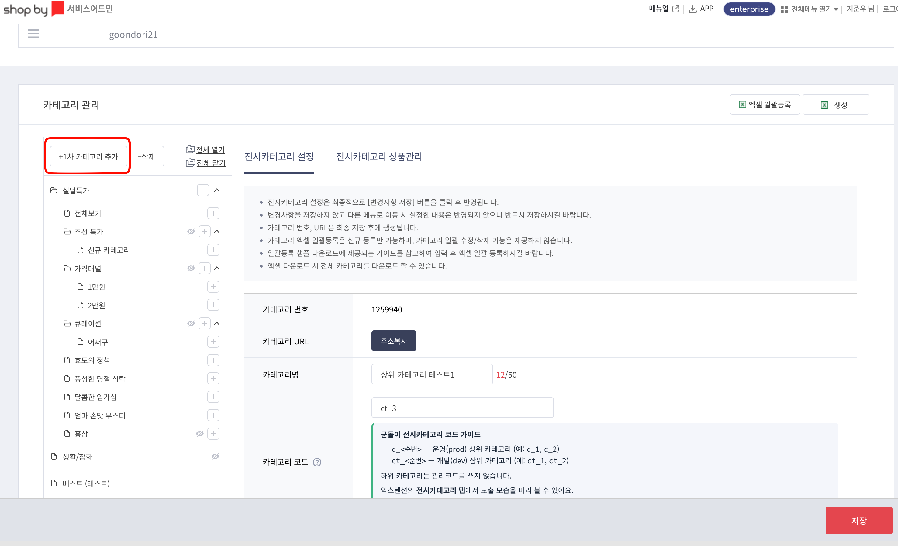
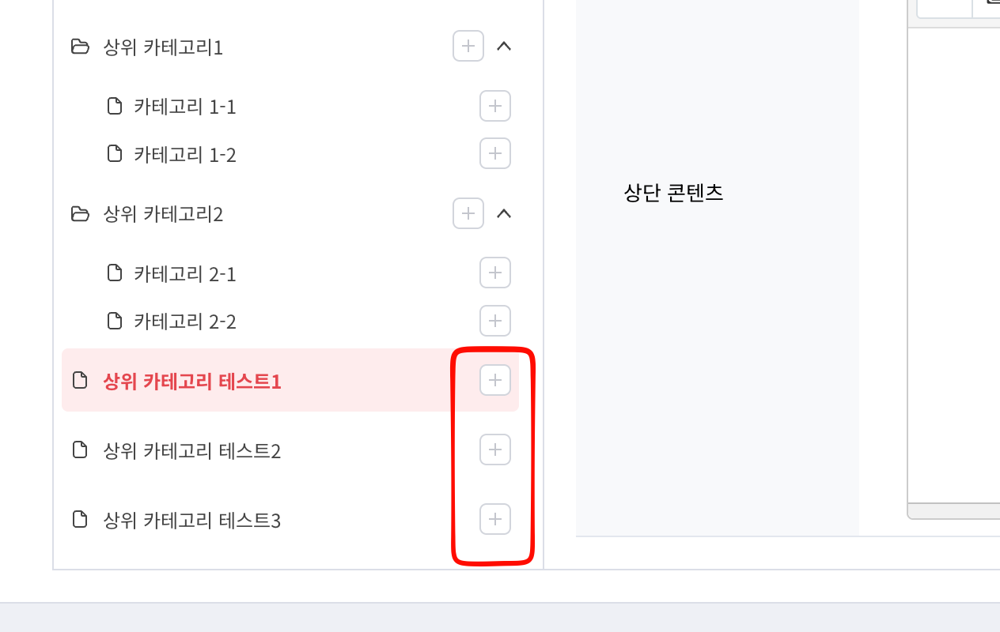

# 군돌이 샵바이 진열·배너 익스텐션 사용 가이드

> MD가 샵바이 어드민에서 **상품 진열 / 헤드리스 배너 / 브랜드 추가설명 / 전시카테고리** 를 빠르고 안전하게 다룰 수 있도록 도와주는 Chrome 확장입니다.

---

## 📦 1. 설치 (zip 파일로 Chrome 개발자 모드 사용)

> 별도 빌드 없이 전달받은 **zip 파일** 만으로 Chrome 에 설치합니다.

### 1-1. zip 파일 준비

담당자에게 전달받은 zip (예: `goondori-shopby-extension-0.0.0-chrome.zip`) 을 PC 의 **고정된 폴더** 에 저장합니다.

> ⚠️ 압축을 푼 폴더를 **삭제하거나 이동하면 확장이 비활성화** 됩니다. `다운로드` 폴더보다는 `~/Documents/extensions/` 같은 영구 보관 위치를 추천합니다.

### 1-2. zip 압축 해제

| OS | 방법 |
| --- | --- |
| macOS | zip 파일 더블 클릭 → 같은 위치에 폴더 생성됨 |
| Windows | zip 우클릭 → **압축 풀기** → 원하는 위치 지정 |

해제하면 `manifest.json` 이 들어있는 폴더가 생깁니다. 이 **폴더 경로** 가 다음 단계의 입력값입니다.

### 1-3. Chrome 개발자 모드 활성화

1. Chrome 주소창에 `chrome://extensions` 입력 후 이동
2. 페이지 **우측 상단** 의 「**개발자 모드(Developer mode)**」 토글을 **ON**
3. 상단에 `압축해제된 확장 프로그램을 로드합니다` 버튼이 나타남

### 1-4. 확장 로드

1. 「**압축해제된 확장 프로그램을 로드합니다**」(Load unpacked) 클릭
2. 1-2 에서 압축 해제한 **폴더** 선택 (그 안에 있는 `manifest.json` 이 아닌, **폴더 자체** 선택)
3. 카드에 `군돌이 샵바이 진열·배너 관리` 가 나타나면 성공

### 1-5. 확장 핀 고정 및 첫 실행

1. Chrome 주소창 옆 **퍼즐 아이콘 🧩** 클릭
2. **군도리 샵바이 진열·배너 관리** 의 핀 아이콘을 눌러 툴바에 고정
3. 고정된 아이콘 클릭 → 우측에 사이드패널이 열림
4. 사이드패널 상단에 `Shopby MD Panel · 군돌이 샵바이 진열 관리` 헤더가 보이면 정상

### 1-6. 업데이트 받는 방법

새 zip 을 전달받았을 때:

1. 기존 폴더의 내용을 **새 zip 의 내용으로 덮어쓰기** (폴더 경로는 그대로 유지)
2. `chrome://extensions` 페이지에서 해당 카드의 **새로고침 아이콘 ↻** 클릭
3. 사이드패널을 닫았다 다시 열면 새 버전이 반영됨

> 폴더 경로를 그대로 유지하면 매번 다시 「압축해제된 확장 로드」 를 누를 필요가 없습니다.

### 1-7. 권한 안내

설치 시 Chrome 이 안내하는 권한:

- `sidePanel` · `storage` · `activeTab` · `scripting`
- 호스트 접근: `https://*.shopby.co.kr/*`, `https://shop-api.e-ncp.com/*`

샵바이 어드민·Shop API 외 다른 사이트는 건드리지 않습니다.

---

## 🧭 2. 전체 구조 한눈에 보기

| 영역 | 어디서 동작? | 무엇을 함? |
| --- | --- | --- |
| **사이드패널 — 진열 탭** | 어디서든 열림 (어드민 탭에서 의미 있음) | 진열 ID 조립 · 진열명/색상 편집 · 한 번에 채우기 |
| **사이드패널 — 브랜드 탭** | 어디서든 열림 | 브랜드 진열 슬롯(`c_n`/`ct_n`) 미리보기 · 카드 클릭 → 어드민 편집 페이지 자동 이동 |
| **사이드패널 — 전시카테고리 탭** | 어디서든 열림 | 전시 상위 카테고리 코드순(`c_n`/`ct_n`) 미리보기 · 행 클릭 → 어드민 트리에서 자동 선택·편집 |
| **컨텐트 스크립트 (어드민 자동 주입)** | `*.shopby.co.kr/*` 모든 프레임 | 폼 자동 채우기 · 배너 페이지 인라인 가이드 · 브랜드/전시카테고리 가이드 inject |

> 어드민 폼은 `enterprise-remote.shopby.co.kr` iframe 안에 렌더되거나 부모 셸에서 직접 렌더되는 경우가 섞여 있습니다. 확장은 `allFrames: true` 로 양쪽 모두에 주입됩니다.

---

## 🛍 3. 진열 탭 사용법

> **Sidebar 위치**: 사이드패널 상단 탭 → `진열`

### 3-1. 진열 ID 빌더

`shopby-display.md` 의 ID 규칙(`{c|ct}_{순서}_{p|s}_{t|b|n}_{상세}`)을 폼 위젯으로 조립합니다.

| 필드 | 설명 | 예시 |
| --- | --- | --- |
| 기존 진열 ID | 이미 만든 ID를 붙여넣어 모든 필드를 역복원 | `c_3_s_b_43215615` |
| 환경 | `c` 운영 / `ct` 테스트 | `c` |
| 순서 | 1 이상 정수 | `1` |
| 표시 방법 | `p` 페이지네이션 / `s` 스와이프 | `p` |
| 타입 | `t` 사용자 / `b` 브랜드 / `n` 일반 | `t` |
| 사용자유형 | 칩으로 다중 선택 (병·곰·가·지·부·장·팬) | `병부장` |
| 브랜드 | 검색 가능한 드롭다운 — 브랜드명/번호로 검색 | `필립스 #43215615` |
| 라벨 | 일반(`n`) 타입의 자유 라벨 (시스템 무시) | `베스트` |

**미리보기 바**에 실시간으로 조립 결과와 검증 결과(`정상` / `경고 N` / `오류 N`)가 표시됩니다.

> 오류가 있으면 하단 「어드민에 채우기」 버튼이 비활성화됩니다.

### 3-2. 진열명 편집 (제목 + 색상)

| 필드 | 설명 |
| --- | --- |
| 진열명 | `input[name="title"]` 에 들어갈 값. `{이름}` 예약어 사용 가능 |
| 강조 단어 | 단어 칩을 추가하고 색 동그라미로 HEX 선택. 진열명에 있는 단어만 색칠됨 |
| 미리보기 이름 | `{이름}` 치환 결과를 시뮬레이션할 때만 쓰는 값 (저장값과 무관) |

저장값은 `진열 상세설명(sectionExplain)` 필드에 `단어#HEX, 단어#HEX` 형식으로 들어갑니다.

**예시**

```
진열명     : {이름}님을 위한 추천 상품
강조 단어  : {이름} = #008000,  추천 상품 = #FFFF00
어드민 저장값
  title          : {이름}님을 위한 추천 상품
  sectionExplain : {이름}#008000, 추천 상품#FFFF00
앱 표시 결과    : 지성현님을 위한 추천 상품
```

> 진열명에 **존재하지 않는** 단어를 강조 칩에 넣으면 미리보기에 `경고` 가 뜹니다.

### 3-3. 노출여부

라디오 형태로 `노출 (Y)` / `비노출 (N)` 선택. **다시 누르면 선택 해제** 되며, 선택 해제 상태에서는 어드민의 기존 값을 **덮어쓰지 않습니다**. (빈 값으로 덮어쓰는 사고 방지)

### 3-4. 「어드민에 채우기」 실행

1. 어드민의 **상품 진열 수정** 페이지를 활성 탭으로 둠
2. 사이드패널의 빨간 「어드민에 채우기」 버튼 클릭
3. 채워진 input은 **녹색 outline**, 실패한 필드는 **빨간 outline** 으로 1.4초간 깜빡임
4. 버튼 아래에 `채움 N건 / 실패 N건` 리포트가 표시됨

| 실패 사유 | 의미 | 대응 |
| --- | --- | --- |
| `어드민 페이지에서 열어주세요` | 활성 탭이 `*.shopby.co.kr` 이 아님 | 어드민 탭 활성화 후 재시도 |
| `selector not found` | 폼이 아직 렌더되지 않았거나 다른 페이지 | 폼이 완전히 뜬 뒤 재시도 |

> 빈 값(진열명/색상/노출여부 미입력)은 **전송 자체를 생략** 하므로 어드민의 기존 값이 보존됩니다.

---

## 🎨 4. 브랜드 탭 사용법

> **Sidebar 위치**: 사이드패널 상단 탭 → `브랜드`

브랜드의 **추가 설명(extraInfo)** 에 적은 슬롯 토큰(`c_1`, `ct_3` 등)을 기준으로 실제 노출 모습을 미리 봅니다.

### 4-1. 환경 토글

```
┌────────────────┐
│ 운영(prod)  ●  │   ← c_1, c_2 … 토큰 인식
│ 개발(dev)      │   ← ct_1, ct_2 … 토큰 인식
└────────────────┘
```

토글만 바꾸면 같은 데이터로 즉시 재계산되며 API 재호출은 하지 않습니다.

### 4-2. 카루셀 + 리스트

- **카루셀**: 실제 앱 화면에 가까운 가로 스크롤 미리보기
- **리스트**: `c_1` → `c_2` → … 순서로 정렬된 확정 노출 순서

**충돌(같은 슬롯에 여러 브랜드)** 발생 시 ⚠ 아이콘이 표시됩니다.

### 4-3. 리스트 행 클릭 → 어드민 편집 페이지로 이동

리스트의 행을 클릭하면:

1. 활성 탭(어드민)에 메시지 전송
2. 좌측 브랜드 트리에서 해당 브랜드를 **자동 선택**
3. `브랜드 추가 설명(extraInfo)` 편집 화면으로 이동

| 결과 메시지 | 의미 |
| --- | --- |
| (성공) 화면 전환 | 정상 이동 |
| `관리자 탭이 아니에요` / `wrong-host` | 활성 탭이 어드민이 아님 |
| `not-found` | 해당 브랜드 번호를 트리에서 찾지 못함 |

### 4-4. 슬롯 토큰 작성 규칙 (어드민 측)

브랜드 수정 페이지의 **추가 설명(extraInfo)** 칸에 아래처럼 작성합니다.

```
c_1, c_3        ← 운영 1·3번 슬롯에 노출
ct_2            ← 개발 2번 슬롯에 노출
c_1 ct_1        ← 두 환경 동시 지정
```

- 구분자: 콤마 / 공백 / 세미콜론 모두 허용
- `c_10` 과 `c_1` 은 단어 경계 기반으로 정확히 구분됨
- `c_0` 등 0 이하 슬롯은 무시
- 익스텐션이 어드민 페이지의 추가 설명 입력란(`input[name="brandInfo.extraInfo"]`) **바로 아래** 에 토큰 가이드 박스를 자동 inject 합니다.

> [!CAUTION]
> **🔴 브랜드 노출 삭제(빼기)** — 진열에서 브랜드를 빼고 싶으면, 추가 설명(extraInfo)의 슬롯 토큰 `c_1` · `ct_1` 등의 **값을 `''`(빈 값)으로 바꿔** 저장하면 됩니다. 토큰을 지워 빈 값으로 만들면 해당 브랜드는 미리보기/앱 노출에서 제외됩니다. (브랜드 자체를 삭제하는 게 아니라 진열 슬롯만 비우는 것)

---

## 🪧 5. 헤드리스 배너 페이지 인라인 가이드

> 경로: 샵바이 어드민 → 헤드리스 배너 → `스토어_메인배너` / `스토어_띠배너` 의 **수정** 페이지

사이드패널을 열지 않아도 어드민 페이지에 **자동으로** 가이드가 부착됩니다.

### 5-1. 모드 자동 판별

| 모드 | 판별 기준 (`input[name="sectionName"]` 의 value) | 부착되는 가이드 |
| --- | --- | --- |
| **띠 배너** | 값에 `띠배너` 포함 (예: `스토어_띠배너`) | 진열 선택기 + 띠배너 전용 힌트 |
| **메인 배너** | 값에 `메인배너` 포함 (예: `스토어_메인배너`) | 메인배너 전용 힌트 |

> SPA 라우팅으로 모드가 바뀌면 자동으로 가이드도 교체됩니다.

### 5-2. 띠 배너 가이드 핵심

| 위치 | 톤 | 메시지 |
| --- | --- | --- |
| 구좌명 | ⚠ warn | **구좌명이 아니라 「연결할 진열 ID」 를 그대로 입력** (자유 입력 금지) |
| 사이즈(width) | ℹ info | 띠배너는 이미지 비율 설정이 무시됨 |
| 콘텐츠명 | ℹ info | MD 식별용 — 앱에는 표시 안 됨 |
| 랜딩 URL | ⚠ warn | 앱 개발자와 사전 협의 후 입력 |

추가로 **구좌명 옆 진열 선택기(SectionAnchor)** 가 부착되어 사이드패널의 진열 빌더와 동일한 셀렉터로 진열 ID 를 골라 채울 수 있습니다.

### 5-3. 메인 배너 가이드 핵심

| 위치 | 톤 | 메시지 |
| --- | --- | --- |
| 「구좌 1/2」 헤더 | ⚠ warn | **16:9 / 3:2 두 구좌 중 하나만 「사용」**, 나머지는 「사용 안 함」 |
| 구좌명 | ℹ info | MD 자유 식별 필드 — 앱에는 미사용 |
| 사이즈(width) | ⚠ warn | `16:9` 또는 `3:2` 만 입력 (그 외 입력 시 기본값 16:9) |
| 콘텐츠명 | ℹ info | MD 식별용 — 앱에는 표시 안 됨 |
| 랜딩 URL | ⚠ warn | 앱 개발자와 사전 협의 후 입력 |

---

## 🛟 6. 자주 묻는 트러블슈팅

| 증상 | 원인 후보 | 해결 |
| --- | --- | --- |
| 사이드패널이 안 열림 | 핀 고정 안 됨 / 권한 거부 | 퍼즐 아이콘 → 핀 고정 → 아이콘 다시 클릭 |
| 「채우기」 눌렀는데 아무 반응 없음 | 활성 탭이 어드민이 아님 | 어드민 탭을 활성화한 뒤 재시도 |
| 폼이 채워졌는데 일부 필드만 채워짐 | 폼이 비동기로 늦게 렌더됨 | 폼이 완전히 보일 때까지 기다린 뒤 재시도 |
| 브랜드 리스트가 비어 있음 | `extraInfo` 에 슬롯 토큰 미입력 | 어드민 브랜드 수정 → 추가 설명에 `c_1` / `ct_1` 등 입력 |
| 슬롯 충돌 ⚠ 표시 | 같은 슬롯 번호에 두 브랜드가 동시 지정 | 한쪽 브랜드의 토큰을 다른 슬롯으로 옮김 |
| 배너 페이지에 가이드가 안 뜸 | 경로가 `/headless-banners/edit` 가 아님 | 수정 페이지로 이동했는지 확인 |
| 가이드가 띠/메인이 잘못 잡힘 | `sectionName` 값이 비어있거나 양쪽 토큰 모두 미포함 | 배너명을 `스토어_띠배너` / `스토어_메인배너` 처럼 명명 |
| 전시카테고리 리스트가 비어 있음 | 상위 카테고리 **관리코드** 미입력 | 어드민 전시카테고리 수정 → 상위 관리코드에 `c_1` / `ct_1` 등 입력 |
| 전시카테고리 행 클릭했는데 `not-found` | 트리에 해당 이름이 없거나 다른 환경 | 어드민 전시카테고리 트리가 열린 탭인지, 환경(c/ct) 토글이 맞는지 확인 |

---

## 🗂 7. 전시카테고리 탭 사용법

> **Sidebar 위치**: 사이드패널 상단 탭 → `전시카테고리`

샵바이 어드민의 전시카테고리는 **트리 형태로 노출 순서를 직접 보기 어렵습니다**. 이 탭은 Shop API(`GET /categories`)로 전시카테고리 트리를 받아, 상위 카테고리의 **관리코드(`c_n` / `ct_n`)** 를 기준으로 실제 앱에서 노출되는 **코드순(오름차순)** 을 한눈에 보여 줍니다.

### 7-1. 코드 규칙

전시 상위 카테고리의 **관리코드** 에 슬롯 번호를 부여합니다.

| 코드 | 의미 | 예시 |
| --- | --- | --- |
| `c_<순번>` | 운영(prod) 상위 카테고리 | `c_1`, `c_2`, `c_3` |
| `ct_<순번>` | 개발(dev) 상위 카테고리 | `ct_1`, `ct_2` |

- 순번은 **1 이상 정수**. `c_0` 등 0 이하는 무시됩니다.
- **하위 카테고리는 관리코드를 쓰지 않습니다.** (상위에서 코드순이 정해지면 하위는 그 아래에 묶임)
- 코드가 **없는 상위 카테고리(미분류)** 는 미리보기에서 제외됩니다.

### 7-2. 어드민에서 전시카테고리 추가하기

> 경로: 샵바이 서비스어드민 → **카테고리 관리(전시카테고리)**



**① 상위(1차) 카테고리 추가**

좌측 상단의 **「+1차 카테고리 추가」** 버튼을 누르면 트리 맨 아래에 새 상위 카테고리가 생깁니다.

**② 하위 카테고리 추가**

추가하려는 행 오른쪽의 **`+` 버튼** 을 누르면 그 카테고리 **바로 아래에 하위 카테고리** 가 생깁니다. (아래 트리에서 빨간 박스로 표시된 버튼)



**③ 카테고리명 · 카테고리 코드 입력**

새로 만든 카테고리를 클릭해 우측 **「전시카테고리 설정」** 패널에서 값을 채웁니다.

| 필드 | 입력값 | 비고 |
| --- | --- | --- |
| 카테고리명 | 표시 이름 (예: `상위 카테고리 테스트1`) | 최대 50자, 앱/익스텐션에 그대로 표시됨 |
| 카테고리 코드 | **상위만** `c_<순번>` / `ct_<순번>` (예: `ct_3`) | 하위는 비워 둠. 입력란 아래에 **군돌이 코드 가이드** 가 자동으로 붙음 |

> 위 화면의 카테고리 코드 입력란 아래 초록 박스가 익스텐션이 자동 주입한 **「군돌이 전시카테고리 코드 가이드」** 입니다. `c_<순번>`(운영) / `ct_<순번>`(개발) 규칙을 그 자리에서 바로 확인할 수 있습니다.

> [!CAUTION]
> **🔴 전시카테고리 노출 삭제(빼기)** — 코드순 노출에서 카테고리를 빼고 싶으면, 상위 카테고리의 **관리코드(`c_1` · `ct_1` 등)의 값을 `''`(빈 값)으로 바꿔** 저장하면 됩니다. 관리코드를 비우면 해당 상위 카테고리는 미리보기/앱의 코드순 목록에서 제외됩니다. (카테고리 자체를 삭제하는 게 아니라 코드만 비우는 것)

**④ 저장**

우측 하단 **빨간 「저장」** 버튼(또는 「변경사항 저장」)을 눌러야 반영됩니다.

> ⚠️ 카테고리 **번호·URL 은 최종 저장 후에 생성** 됩니다. 저장 없이 다른 메뉴로 이동하면 입력 내용이 사라지니 반드시 저장하세요.

**⑤ 익스텐션 탭에서 확인**

저장 후 익스텐션 **전시카테고리** 탭에서 **↻ 새로고침** 을 누르면, 방금 넣은 코드 순서대로 미리보기에 반영됩니다.

예를 들어 위 화면처럼 상위 카테고리에 `ct_1` → `상위 카테고리 테스트1`, `ct_2` → `테스트2`, `ct_3` → `테스트3` 을 부여하고 **테스트 ct** 환경 토글을 켜면, 탭에는 다음과 같이 **코드순(오름차순)** 으로 표시됩니다.

```
전시카테고리  [ 운영 c | 테스트 ct ● ]            ↻ 새로고침

▸  ct_1   상위 카테고리 테스트1
▸  ct_2   상위 카테고리 테스트2
▸  ct_3   상위 카테고리 테스트3
```

- `▸` 를 누르면 해당 상위 아래의 **하위 카테고리(카테고리 1-1, 1-2 …)** 가 펼쳐집니다.
- 행의 「어드민에서 열기 ›」 를 누르면 위 어드민 트리에서 같은 카테고리가 **자동 선택** 됩니다. (→ [7-5](#7-5-행-클릭--어드민-트리에서-자동-선택편집))
- 코드를 **비워 둔** 상위 카테고리(미분류)와 **하위 카테고리** 는 미리보기 상위 목록에 나타나지 않습니다.

### 7-3. 환경 토글 (운영 c / 테스트 ct)

```
┌──────────────────────┐
│ 운영 c  ●            │   ← c_1, c_2 … 코드 인식
│ 테스트 ct            │   ← ct_1, ct_2 … 코드 인식
└──────────────────────┘
```

토글만 바꾸면 **같은 데이터로 즉시 재계산** 되며 API 재호출은 하지 않습니다. 우측 「↻ 새로고침」 으로 트리를 다시 받아올 수 있습니다.

### 7-4. 미리보기(카루셀) + 리스트

- **카루셀**: 실제 앱 화면에 가까운 가로 스크롤 미리보기
- **리스트**: `c_1` → `c_2` → … 순서로 정렬된 확정 노출 순서
  - 각 행: `관리코드` · `카테고리명` · 「어드민에서 열기 ›」 버튼
  - 행 왼쪽 `▸` 를 누르면 **하위 카테고리** 가 펼쳐집니다.

> 코드 설정된 상위가 하나도 없으면, 어드민 전시카테고리의 **상위 관리코드** 에 `c_1`, `c_2` …(또는 `ct_1`, `ct_2` …) 를 입력하라는 안내가 표시됩니다.

### 7-5. 행 클릭 → 어드민 트리에서 자동 선택·편집

리스트의 「어드민에서 열기 ›」(또는 하위 카테고리명) 를 클릭하면:

1. 활성 탭(어드민)에 `openCategoryEditor` 메시지 전송
2. 트리 상단 **「전체 열기」** 를 눌러 중첩 하위까지 펼침
3. 이름이 일치하는 트리 행을 **자동 스크롤·선택**
4. 편집 폼의 입력란에 **포커스** (상위 → 코드 입력란 / 하위 → 이름 입력란)

| 결과 메시지 | 의미 | 대응 |
| --- | --- | --- |
| (성공) 화면 전환 | 정상 이동 | — |
| `어드민 페이지에서 열어주세요` (`wrong-host`) | 활성 탭이 `*.shopby.co.kr` / `*.e-ncp.com` 이 아님 | 어드민 탭 활성화 후 재시도 |
| `관리자 트리에서 해당 카테고리를 찾지 못했어요` (`not-found`) | 트리에 해당 이름이 없거나 다른 환경 | 전시카테고리 트리 화면인지, 환경 토글이 맞는지 확인 |

### 7-6. 어드민 코드 입력란 가이드 자동 inject

전시카테고리 **편집 폼의 관리코드 입력란** 을 감지하면, 익스텐션이 그 **바로 아래** 에 코드 가이드 박스(`c_<순번>` / `ct_<순번>` 설명)를 자동으로 붙입니다. SPA 재렌더에도 다시 부착됩니다. (위 [7-2](#7-2-어드민에서-전시카테고리-추가하기) 화면의 초록 박스)

### 7-7. 전시 순서 변경 방법 (중요)

전시카테고리 탭 상단의 **「전시 순서 변경 방법」** 접이식 안내에 동일한 내용이 들어 있습니다.

전시 순서는 관리코드로 정해지는데, **관리코드는 중복이 허용되지 않습니다.** 따라서 두 카테고리의 순서를 맞바꾸려면 한쪽 코드를 먼저 **`''`(빈 값)으로 비워** 그 자리를 풀어 준 뒤 옮겨야 하고, **각 변경 사이에 「중복 확인」과 「저장」이 필수** 입니다. (그래야 다음 코드를 바꿀 때 중복이 생기지 않아 shopby 에서 오류 없이 적용됩니다.)

**예) `c_1` ↔ `c_2` 자리 바꾸기**

1. `c_1` → `''`(빈 값) 으로 변경 → **중복 확인** → **저장**
2. `c_2` → `c_1` 으로 변경 → **중복 확인** → **저장**
3. 비워 둔 항목 → `c_2` 으로 변경 → **중복 확인** → **저장**

> 중간 단계의 「중복 확인 + 저장」 을 건너뛰면 일시적으로 같은 코드가 두 곳에 존재해 shopby 가 저장을 거부합니다. 반드시 한 단계씩 저장하며 진행하세요.
